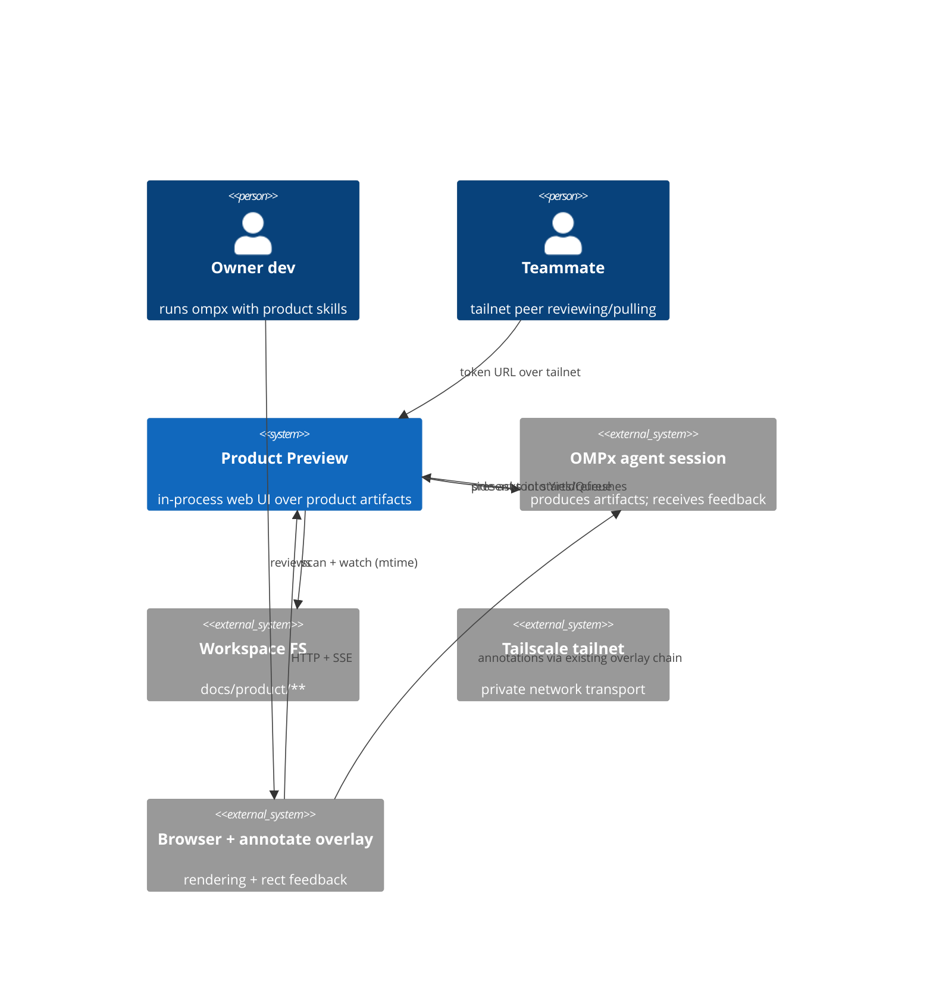
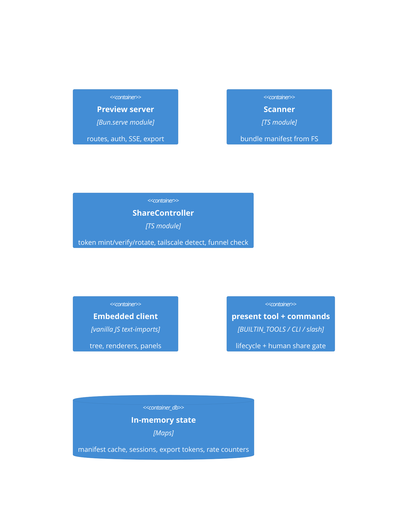
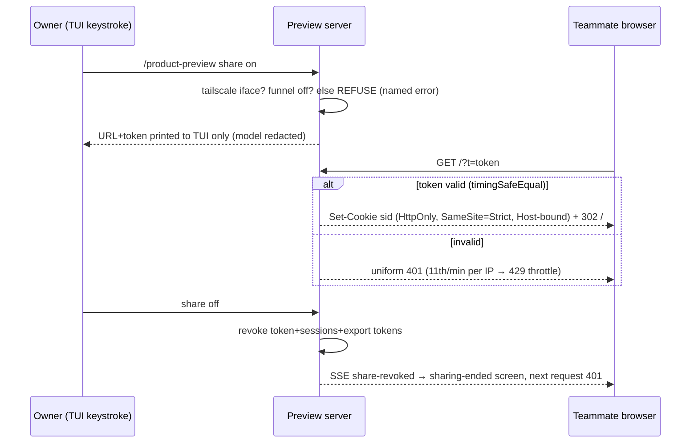
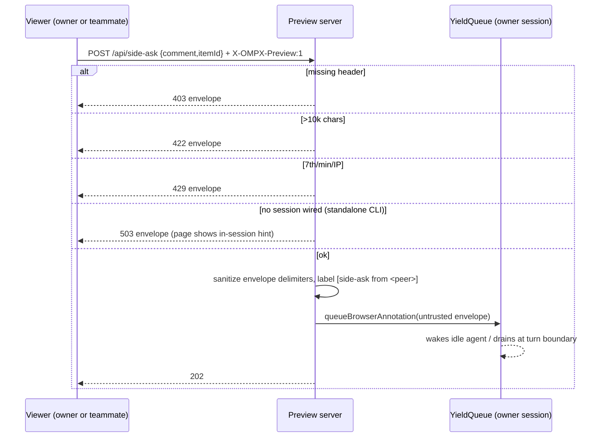
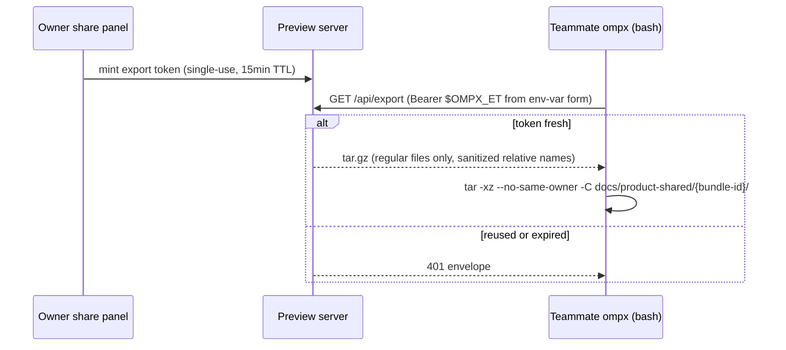

# Product Preview WebUI — Architecture (2026-07-12)

**Spec**: docs/product/specs/2026-07-12-product-preview-webui.md   **Design**: docs/product/design/2026-07-12-product-preview-webui-ui.md

## Current system (brownfield map)

- Annotate chain (exists): page overlay → `__ompxAnnotateSubmit` → tab worker → supervisor → annotation-router (waiter→listener→20-buffer) → `queueBrowserAnnotation` → YieldQueue → idle-injected user message with screenshot (`prompts/tools/browser-annotation.md` envelope). Reused as-is for rect feedback; side-ask reuses only the LAST hop (queue delivery + envelope).
- `annotate-http` (exists): loopback Bun.serve intake with pairing codes — precedent for token throttling; NOT reused directly (different auth model).
- `packages/stats` (exists): Bun.serve + embedded client archive — precedent for a local dashboard; its React/tar-embed pipeline deliberately NOT copied (ADR-2).
- Registries (exist): `BUILTIN_TOOLS` factory map, `cli-commands.ts`, `BUILTIN_SLASH_COMMAND_REGISTRY` — extension points for the tool/commands.
- TUI mermaid is ASCII-only — the browser is the only surface that renders real diagrams; this feature adds it without touching the TUI path.

## System context

## Containers

Justifications (fewest-moving-parts): ONE process (the ompx session), ONE listener socket, ZERO databases. `share` is a separate module (not container) purely for exclusive test ownership; `client` is static text served by `server`. No split earns a second deployable — a dev tool for ≤10 viewers needs none.

API edges follow skill://api-design: single error envelope `{"error":{"code","message"}}` on every 4xx/5xx; no pagination needed at ≤500 items (manifest is one document — named exception to cursor rule); side-ask POST is intentionally NON-idempotent fire-and-forget with rate limiting instead of idempotency keys (duplicate ask = visible duplicate message, self-correcting; documented tradeoff).

## Critical flows

### Share enable + teammate first hit

### Side-ask delivery

### Export / pull handoff

## Data model & ownership

| Data | Source of truth | Writer | Lifetime/retention |
|---|---|---|---|
| Artifacts (md/html) | workspace FS `docs/product/**` | the agent (sole writer; web is read-only) | user-owned files; feature never deletes |
| BundleManifest | derived from FS scan | scanner | in-memory; rebuilt on poll/refresh |
| Share token / cookie sessions / export tokens | ShareController maps | share module | in-memory; dead at share-off or process exit (deliberate: restart = re-share) |
| Rate/throttle counters | server maps | server | rolling windows, in-memory |

No database by design: nothing outlives the process that isn't already a user file. Cache = manifest only; invalidation = the watch poll itself.

## NFR envelope

| NFR | Number | Grade |
|---|---|---|
| Concurrent viewers | ≤10 | assumed (team-scale tailnet) |
| Bundle size | ≤500 files / ≤20MB | assumed, generous vs observed repos |
| Edit→browser latency | ≤2s p95 (1s poll + 500ms settle) | per spec |
| Availability | dev-tool: restart = rerun `present`; no SLO | measured trivially |
| Memory overhead | ≤50MB incl. embedded mermaid | assumed — VERIFY at integration (binary gate) |
| Cost | $0 (local/tailnet) | measured |

All load-bearing numbers are assumed at team scale — the design intentionally has an order of magnitude of headroom (Bun.serve static + SSE handles hundreds); no number justifies more architecture than this.

## Build vs buy

| Capability | Decision | Why / exit |
|---|---|---|
| Markdown render | BUY `marked` (pinned) | boring, tiny; exit: any md renderer |
| Sanitize | BUY `dompurify` (pinned) | never hand-roll sanitizers (security-review) |
| Diagrams | BUY `mermaid` (pinned) | C4+sequence+flow in one lib; exit: none needed, content is plain mermaid text |
| Tailscale detect | BUILD (~30 lines) | interface scan + CLI fallback; a tailscale SDK dep would be lock-in for one lookup |
| Auth/session | BUILD (thin) | 128-bit CSPRNG token + cookie map; an auth framework is oversized for one token |
| Archive | Bun.Archive (stdlib) | already used by stats |

## Mistakes gate

| # | Mistake | Status |
|---|---|---|
| 1 | Premature microservices | mitigated — one process, zero new deployables |
| 2 | Sync chain where queue belongs | N/A — single hop; side-ask lands in the EXISTING YieldQueue |
| 3 | Unbounded queue | mitigated — YieldQueue reuse inherits its 20-entry annotation buffer + rate limit upstream |
| 4 | Missing idempotency | mitigated — export tokens single-use; side-ask non-idempotent by design with rate cap (documented above) |
| 5 | No rollback/migration | N/A — no schema; feature off = no state; plan slices independently revertible |
| 6 | SPOF | N/A — dev tool; process death = tab dies; restart is one tool call |
| 7 | Missing authz boundary | mitigated — Host allowlist → auth → route, loopback-vs-share matrix in spec; raw mockup route loopback-only server-side |
| 8 | Cost blowup | N/A — $0 local |
| 9 | Resume-driven tech | mitigated — vanilla JS chosen over React; three boring pinned libs |
| 10 | No observability at boundaries | mitigated — logger on auth failures/throttles/SSE drops/export (token values never logged; grep-gate test) |
| 11 | Chatty calls / N+1 | mitigated — one manifest fetch + per-doc fetch on click; SSE pushes deltas |
| 12 | Greenfield fantasy | mitigated — reuses annotate chain, YieldQueue, registries; Current-system map above |

## Decisions

### ADR-1: In-process module, not a package
**Context**: side-asks must reach the live session queue. **Options**: (A) module in coding-agent — direct YieldQueue access; (B) `packages/product-preview` — clean boundary, needs IPC for queue delivery. **Choice**: A; B's IPC buys nothing for a feature whose consumers (tool/slash) are in-process. **Consequences**: coding-agent grows; preview can't ship standalone. **Revisit when**: another package needs to embed the preview.

### ADR-2: Zero-build client
**Context**: stats' React pipeline needs archive gen hooks in two build scripts. **Options**: (A) mirror stats; (B) vanilla text-imports. **Choice**: B — mostly-rendered-markdown UI doesn't earn a framework; text imports embed in the binary for free. **Consequences**: no JSX ergonomics; DOM code by hand. **Revisit when**: client complexity approaches stats-dashboard level.

### ADR-3: Side-ask = server POST → YieldQueue
**Context**: round-1 review killed the annotate-binding transport (dies on reload/user-opened tabs; CLI mode has no binding). **Options**: (A) `__ompxAnnotateSubmit` binding; (B) POST /api/side-ask with header+auth+rate. **Choice**: B; binding stays as rect-annotation enhancement only. **Consequences**: one new authenticated endpoint to defend (done: header+rate+sanitize). **Revisit when**: never expected.

### ADR-4: Embed marked/dompurify/mermaid from pinned deps
**Context**: offline/enterprise use; compiled binary ships no node_modules. **Options**: (A) CDN; (B) vendored copies in repo; (C) pinned deps text-imported straight from node_modules at build. **Choice (as designed)**: C. **Choice (as shipped, execution amendment)**: B+gate — marked@18's exports map blocks deep bare-specifier text imports of its UMD build, so all three single-file browser builds are committed under `client/vendor/` and the "vendor bundles" drift test pins each copy byte-for-byte to its pinned node_modules dist source (a dep bump without re-vendoring fails CI; self-containment asserted too). **Consequences**: ~3.5MB vendored JS in git, but drift is CI-visible and embedding stays build-automatic. **Revisit when**: marked exports its UMD dist path (switch back to C).

### ADR-5: Mockup dual-route
**Context**: round-1: iframe breaks annotate rects; round-2: full-page scripted mockups can self-navigate/exfiltrate on an authed origin. **Options**: (A) full-page only; (B) framed only; (C) framed sandbox for all + raw full-page loopback-only. **Choice**: C. **Consequences**: two routes to test; owner annotates via raw, teammates get sandbox. **Revisit when**: annotate overlay learns iframe coordinates.

### ADR-6: Token→cookie exchange, Host-bound sessions
**Context**: `?t=` leaks via history/referer; EventSource can't set headers; cookies aren't port-scoped. **Options**: (A) query token everywhere; (B) Bearer-only (breaks EventSource); (C) one-time query→HttpOnly SameSite=Strict cookie, session record bound to exact Host, 302 strips query, Bearer kept for curl. **Choice**: C. **Consequences**: session map + revocation bookkeeping. **Revisit when**: HTTPS/serve integration arrives.

### ADR-7: Share enable = human keystroke only
**Context**: round-2: prompt-level gating is not enforcement; injected agent could self-share. **Options**: (A) tool arg + prompt rules; (B) TUI confirm dialog on tool call; (C) tool REJECTS share:true; only slash/CLI (human-typed) enable. **Choice**: C — strongest control, zero new confirm infra; token printed to TUI only, model sees redacted result. **Consequences**: agent can't fully automate sharing (intended). **Revisit when**: harness gains a first-class human-approval primitive for tools.

### ADR-8: SSE + server mtime poll
**Context**: fs.watch recursive is platform-inconsistent; repo has no watcher precedent. **Options**: (A) fs.watch; (B) client polling; (C) server mtime+size poll (1s, 500ms settle) → SSE (15s heartbeat). **Choice**: C — boring, cross-platform, instant enough (≤2s p95). **Consequences**: 1 stat-sweep/s while serving (negligible at ≤500 files). **Revisit when**: bundle sizes make the sweep measurable.

### ADR-9: Export = server-built tar + single-use TTL token
**Context**: round-2: bearer in argv leaks via history/ps; long-lived token in a paste-prompt is an exfil key. **Options**: (A) main token in curl arg; (B) single-use 15-min export token, env-var form, server-built tar of regular files only. **Choice**: B. **Consequences**: export token mint/consume state; prompt regeneration after use. **Revisit when**: signed URLs or tailscale identity headers become available.

## Open questions & risks

| Item | Owner | Default |
|---|---|---|
| mermaid embedded size vs binary budget | integration gate | accept ≤5MB growth; else lazy-extract like stats |
| MagicDNS names in share URL | implement-time | IP-only v1 |
| YieldQueue behavior under side-ask burst while streaming | verify at integration (existing aside-provider drains at turn boundaries) | rely on rate limit 6/min/IP |

Self-check (skill://product-architecture rubric): every container justified; 3 critical flows each with failure branches; every entity has one source of truth + writer; NFR numbers graded, no adjectives; 12/12 gate rows marked with substance; every ADR ≥2 real options + revisit trigger; mermaid blocks parse (C4Context/C4Container/sequenceDiagram syntax); brownfield map present with incremental reuse path.

## v2

### Comment and answer routes

All v2 feedback routes retain the preview authentication and `X-OMPX-Preview: 1` header checks, and use the existing error envelope and validation/rate-limit semantics.

| Route | Method | Result |
|---|---|---|
| `/api/comments?itemId=<id>` | GET | Lists `PreviewCommentWire` records for one item, or all comments when omitted. |
| `/api/comments` | POST | Creates an anchored comment and returns `201` with its wire shape. |
| `/api/comments/reply` | POST | Adds a reply to a thread and returns the updated wire comment. |
| `/api/comments/resolve` | POST | Sets a thread's resolved state and returns the updated wire comment. |
| `/api/comments/delete` | POST | Deletes a session-owned comment and returns `{ok:true}`. |
| `/api/answers?itemId=<id>` | GET | Lists persisted option-question answers for the item. |
| `/api/answer` | POST | Persists a question selection and returns `202 {ok:true}`. |

`PreviewCommentWire` never exposes `ownerSid`; it carries the derived `mine` capability instead. Delete authorization compares the request's share-cookie `sid` to the comment owner (with loopback allowed to delete any comment), so display names remain cosmetic and cannot authorize deletion.

### Durable feedback state

`PreviewCommentStore` persists comments and answers in `<preview-root>/.ompx-preview/state.json`. It owns a transactional serial queue: each mutation derives a candidate from the latest committed snapshot inside the queued turn, writes the candidate to a temporary file, atomically renames it into place, and publishes it as committed only after the rename succeeds.

- Reads observe committed state only; a failed write never leaks an uncommitted comment or answer.
- Queue failures do not poison later transactions; later mutations recompute from the last durable state.
- A 2xx mutation response means the state is both durable and readable; a persistence failure returns 500 and makes no visible change.

### Template bridge and delivery

`/mockup/:id` serves the sandboxed template document directly and injects the inline `window.OmpxPreview` bridge before `</body>`. The bridge is not an external script, and `RAW_MOCKUP_CSP` remains unchanged. Its `sendPrompt`, `submitAnswer`, and `ready` messages travel from the template iframe to the parent preview, which validates the iframe source and forwards valid feedback through the authenticated preview endpoints. `/mockup-raw/:id` remains the loopback-only annotation route.

The production session receives every accepted side-ask, comment, reply, and answer via `PREVIEW_FEEDBACK_MESSAGE_TYPE` steering delivery. The message is formatted as preview feedback before it enters the session queue; standalone CLI mode has no session delivery and preserves the existing unavailable-session behavior.

### Presenter registration

The bundled `presenter` agent is registered alongside other embedded agents and autoloads the `preview-templates` skill. It produces self-contained, responsive HTML templates that use the injected bridge contract; the server remains the only bridge-script owner.
