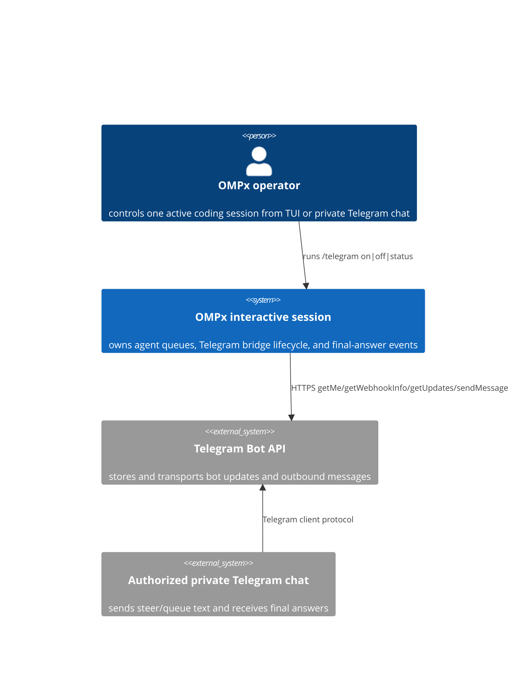
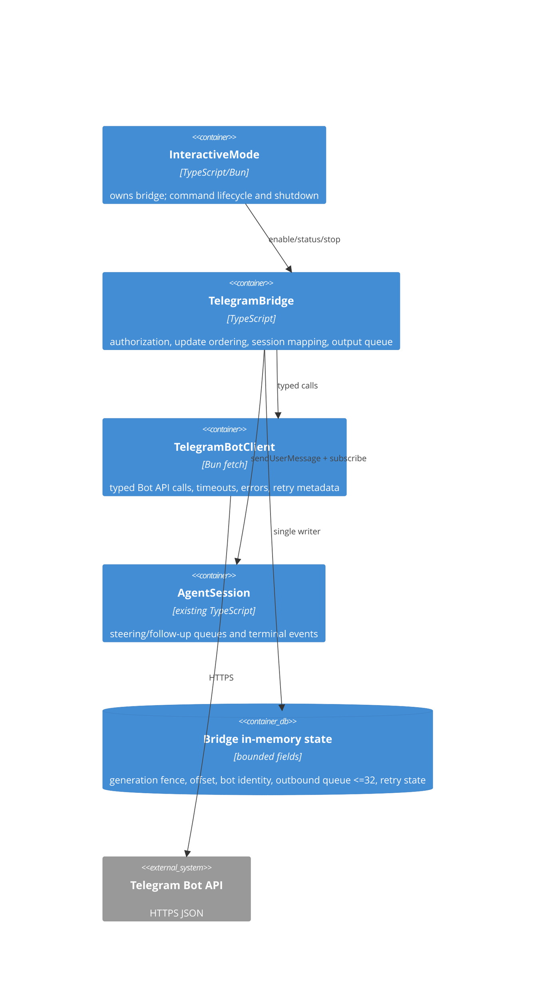

# Telegram Bot Bridge — Architecture (2026-07-27)

**Spec**: docs/product/specs/2026-07-27-telegram-bot-bridge.md   **Design**: approved in conversation; no visual UI artifact

## Current system (brownfield map)

- `InteractiveMode` owns the active `AgentSession` and long-lived collab/live controllers; its shutdown path is the lifecycle boundary for an in-session remote surface.
- `AgentSession.sendUserMessage(content, { deliverAs })` already maps external user text into steering or follow-up queues and schedules idle resumption.
- `AgentSession.subscribe(listener)` exposes terminal `agent_end` and message events; `live/local-endpoints.ts:LocalAgentEndpoint` demonstrates extracting and forwarding the terminal assistant response.
- `packages/utils/src/env.ts` eagerly merges process, project, agent-profile, config-root, and home `.env` values and exports `$env`. The bridge consumes this source rather than reading files itself.
- `BUILTIN_SLASH_COMMAND_REGISTRY` is the user-reachable command registration point. `/product-preview` and collab/live are the nearest lifecycle/wiring precedents.
- No Telegram package, persistent update store, external gateway, or webhook listener exists.

## System context



## Containers



Fewest-moving-parts justification: one existing OMPx process, zero new listeners, zero databases, zero workers, zero services. `TelegramBotClient` and `TelegramBridge` are modules, not deployables; the split isolates provider protocol/error behavior from session semantics and makes both independently testable.

## Critical flows

### Enable and establish the activation boundary

```mermaid
sequenceDiagram
  participant U as TUI operator
  participant M as InteractiveMode
  participant B as TelegramBridge
  participant T as Telegram Bot API
  participant C as Allowed chat
  U->>M: /telegram on
  M->>B: start(token, allowedChatId, session)
  B->>B: validate non-empty token + exact safe integer chat ID
  B->>T: getMe
  B->>T: getWebhookInfo
  alt unauthorized or webhook active
    T-->>B: 401/403 or webhook URL
    B-->>M: failed status; no poller
  else valid
    B->>T: getUpdates(offset=-1, limit=1, timeout=0, allowed_updates=[message])
    T-->>B: newest queued update; Telegram forgets all previous updates
    B->>B: nextOffset=returned update_id+1 (or undefined when empty); deliver none
    B->>T: sendMessage(connection status)
    B-->>M: connected(bot username)
    loop while enabled
      B->>T: getUpdates(offset, timeout=30)
    end
  end
```

### Authorized inbound steer/queue

```mermaid
sequenceDiagram
  participant T as Telegram Bot API
  participant B as TelegramBridge
  participant S as AgentSession
  T-->>B: Update(update_id, message)
  B->>B: validate safe integer update_id and explicit message shape
  alt malformed update_id/protocol shape
    B->>B: fail generation; never guess an acknowledgement cursor
  else chat.type != private or unsafe/mismatched chat.id
    B->>B: reject silently; nextOffset=update_id+1
  else unsupported/empty input
    B->>B: ignore; nextOffset=update_id+1
  else /queue text
    B->>S: sendUserMessage(text, deliverAs=followUp)
    S-->>B: queue-acceptance promise settles
    B->>B: nextOffset=update_id+1
  else plain text or /steer text
    B->>S: sendUserMessage(text, deliverAs=steer)
    S-->>B: queue-acceptance promise settles
    B->>B: nextOffset=update_id+1
  end
  B->>B: generation fence before/after every await and side effect
  alt network repeats previous batch
    B->>B: update_id < nextOffset; skip
  end
```

### Terminal assistant output with ambiguous-send failure

```mermaid
sequenceDiagram
  participant S as AgentSession
  participant B as TelegramBridge
  participant T as Telegram Bot API
  S-->>B: agent_start observed in current generation
  S-->>B: terminal agent_end(messages)
  B->>B: extract + fully chunk final <=4000 code points
  alt all chunks fit in remaining 32-slot capacity
    B->>B: enqueue complete final atomically and contiguously
  else overflow
    B->>B: fail generation before enqueueing any chunk
  end
  loop FIFO chunks
    B->>T: sendMessage(plain text, redirect=error)
    alt 429 with validated retry_after and budget remains
      T-->>B: 429 retry_after=N
      B->>B: abortable wait; retain FIFO head
    else 429 exceeds 5 attempts or 5 minutes
      B->>B: fail generation; do not send later chunks
    else timeout, redirect, 5xx, malformed response (outcome ambiguous)
      B->>B: fail generation; do not retry
    else success
      T-->>B: Message
      B->>B: remove FIFO head
    end
  end
```

## Data model & ownership

| Data | Source of truth | Writer | Lifetime/retention |
|---|---|---|---|
| Bot token | merged process/`.env` environment | operator | never copied to bridge logs/status; process lifetime |
| Allowed chat ID | merged process/`.env` environment | operator | parsed once per enable; process memory only |
| Bot identity | Telegram `getMe` response | bridge | bridge lifetime |
| Next update offset | highest handled/discarded `update_id + 1` | bridge poll loop | bridge lifetime; reset from activation watermark on re-enable |
| Outbound chunks | terminal assistant output whose `agent_start` was observed in the active generation | bridge event listener | atomically enqueued FIFO, maximum 32, cleared on stop/failure |
| Lifecycle generation | monotonic controller counter | command controller | immutable per start; fenced before/after every await/callback; old generation cannot produce effects |

No database or cache is introduced. Telegram is authoritative for unacknowledged updates; OMPx `AgentSession` is authoritative after `sendUserMessage` settles. The activation watermark intentionally discards pre-enable updates.

## NFR envelope

| NFR | Number | Grade |
|---|---|---|
| Controllers | exactly 1 private chat | reported/approved |
| Active sessions per bot token | exactly 1 | approved constraint |
| Telegram batch | 1–100 updates; process serially | Telegram contract |
| Long-poll timeout | 30 s server timeout; abortable client budget >30 s | assumed design |
| Inbound latency | p95 <2 s after Telegram returns an update, excluding agent inference | assumed |
| Outbound capacity | 32 queued chunks × <=4,000 code points | approved design |
| Memory | <1 MiB bridge-owned state at queue bound | assumed |
| Availability | bridge failure must not stop or corrupt the local OMPx session | required invariant |
| Cost | $0 additional service cost; Bot API and local process only | measured architecture |

## Build vs buy

Use Telegram's hosted Bot API; do not build transport infrastructure. Build the narrow client with Bun `fetch` instead of adopting Telegraf/grammY: the required surface is five methods and simple JSON, while an SDK adds dependency/upgrade weight without providing transactional delivery or idempotency. Exit path is trivial because provider calls remain isolated behind `TelegramBotClient`.

## Common-mistakes gate

| # | Check | Result |
|---:|---|---|
| 1 | Premature service split | Mitigated: one existing process, modules only. |
| 2 | Sync call chain needing queue | N/A: long poll is async; outbound has a bounded FIFO. |
| 3 | Unbounded queue/backpressure | Mitigated: 32-chunk bound; overflow fails bridge closed. |
| 4 | Missing idempotency | Mitigated inbound by update offset/runtime dedupe; ambiguous outbound is not retried. |
| 5 | Rollback/migration | N/A: no schema/store; `/telegram off` is immediate rollback. |
| 6 | Single point of failure | Mitigated: Telegram outage disables bridge only; local session remains live. |
| 7 | Missing authz | Mitigated at bridge edge: exact private chat type + exact configured chat ID. |
| 8 | Cost blowup | Mitigated: no paid container/store; rate-limited final-only output. |
| 9 | Novel technology | Mitigated: existing Bun fetch/session/command patterns only. |
| 10 | Boundary observability | Mitigated: redacted lifecycle/retry/rejection/send-failure logs and TUI status. |
| 11 | Chatty calls/N+1 | Mitigated: one long poll; sequential sends only for bounded answer chunks. |
| 12 | Greenfield fantasy | Mitigated: reuses InteractiveMode lifecycle, AgentSession queues/events, and env overlays. |

## Decisions

### ADR-1: Run inside the active interactive session

**Context**: Telegram must steer one already-running session and stop with it.
**Options**: in-process bridge / local sidecar via RPC/collab / hosted gateway.
**Choice**: in-process bridge. It has the shortest authorization and lifecycle path and adds no session-discovery protocol.
**Consequences**: the bot is unavailable when the session exits; multi-session routing is deliberately unsupported.
**Revisit when**: one bot token must control two concurrent OMPx sessions.

### ADR-2: Use long polling, never mutate webhook state

**Context**: OMPx commonly runs behind NAT and has no public listener.
**Options**: `getUpdates` long polling / webhook server / relay gateway.
**Choice**: long polling. If a webhook exists or Telegram reports a competing poller, fail closed with instructions rather than calling `deleteWebhook`.
**Consequences**: one process owns the token's update stream; Telegram outage appears as retrying status.
**Revisit when**: the bridge must remain online independently of OMPx process lifetime.

### ADR-3: Keep offset state in memory with an activation watermark

**Context**: the approved product ignores messages sent while disconnected and has no cross-process continuity requirement.
**Options**: in-memory offset with backlog discard / persistent offset database / Telegram webhook delivery store.
**Choice**: in-memory offset. Enabling uses Telegram's documented `offset=-1` tail read, which forgets all earlier queued updates, then processes only later updates.
**Consequences**: no offline inbox and no transactional exactly-once guarantee across a crash; no migration/store is introduced.
**Revisit when**: offline messages must survive restart or duplicate handling becomes release-blocking in dogfood.

### ADR-4: Fail closed on authorization and secret handling

**Context**: a Telegram message can direct a coding agent with workspace access.
**Options**: token-only access / first-contact pairing / exact configured private chat allowlist.
**Choice**: exact `OMP_TELEGRAM_ALLOWED_CHAT_ID` plus `chat.type === "private"`. Token is transport authentication, never user authorization.
**Consequences**: setup requires two environment values; other chats receive no response or information.
**Revisit when**: multiple explicitly authorized controllers are requested with a revocation model.

### ADR-5: Retry only operations with unambiguous safety

**Context**: Telegram has no idempotency key for `sendMessage`.
**Options**: retry all transient failures / never retry / retry idempotent polling and explicit 429 only.
**Choice**: retry `getUpdates` with capped jittered backoff; retry `sendMessage` only after explicit validated 429 `retry_after`, bounded to 5 attempts or 5 cumulative minutes. Timeout/redirect/5xx/malformed send outcomes fail the bridge without automatic resend.
**Consequences**: an ambiguous outbound answer may require reading the TUI; duplicate Telegram answers are not manufactured by recovery code, and repeated flood control cannot block the FIFO forever.
**Revisit when**: Telegram adds supported idempotency or a durable outbox/dedup protocol is required.


### ADR-6: Fence every lifecycle generation

**Context**: `/telegram on`, `/telegram off`, session switch, shutdown, retry timers, HTTP completion, and session callbacks can interleave across `await` boundaries.
**Options**: best-effort abort only / serialized lifecycle with immutable generation fences / separate worker process.
**Choice**: serialize `off → starting → on → stopping → off` and assign a monotonically increasing generation with its own abort controller, listener, offset, and outbound queue. Check the generation before and after every await, callback, queue mutation, HTTP start, and status mutation.
**Consequences**: stop waits for abortable work to quiesce; synchronous dispose only fences, unsubscribes, and aborts. Old callbacks may settle but cannot affect a later generation.
**Revisit when**: the bridge moves to a worker or persistent daemon with a different ownership boundary.
## Open questions & risks

No open architecture decision remains. Residual risks are explicit in ADR-3 and ADR-5: the system favors no silent backlog execution and no duplicate outbound send over offline delivery guarantees. Release requires an authorization-focused review and independent entry-point QA.
