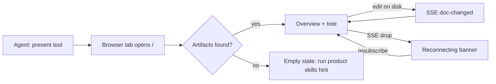
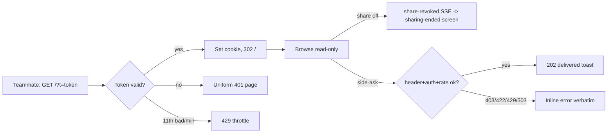

# Product Preview WebUI — UI Design (2026-07-12)

**Spec**: docs/product/specs/2026-07-12-product-preview-webui.md

## Screen inventory & IA

| Surface | Purpose | Entry | Exit | Stories |
|---|---|---|---|---|
| App shell | nav tree + content pane + status strip | `present` tool opens tab; share URL | close tab | S1 |
| Overview | bundle title, brief summary, kind counts, latest changes | default route `/` | nav click | S1 |
| Story map | specs as story board | nav tab (visible when kind=spec exists) | nav | S2 |
| Phases | NOW/NEXT/NOT cut-line columns | nav tab (visible when cut-lines parsed) | nav | S2 |
| Doc view | rendered markdown + mermaid/C4 + wireframe `<pre>` | nav item click | nav | S1, S3 |
| Mockup viewer | framed sandboxed mockup; raw full-page for owner annotate | nav item (kind=mockup); "open raw" (loopback only) | back to gallery | S3, S7 |
| Share panel | owner-only: enable state, URL+token, handoff prompt | shell button (loopback only) | collapse | S6, S8 |
| Side-ask panel | question box to owner agent | shell button (all viewers) | collapse | S4 |

Navigation model: single-page, left tree grouped by kind (mirrors the repo's docs tree mental model); tabs surface derived views (Story map / Phases) only when their source parses — no empty tabs. No pattern #3: tree+pane mirrors the newest analogous surface (stats dashboard) and standard doc viewers.

## Flows





## Wireframes

### App shell (default / success)
```
+------------------------------------------------------------------+
| Product Preview - <bundle title>        [Side-ask] [Share] [Live] |
+---------------+--------------------------------------------------+
| OVERVIEW      |                                                  |
| STORY MAP     |            <content pane>                        |
| PHASES        |                                                  |
| v Specs (2)   |                                                  |
|   spec-a.md   |                                                  |
| v Design (3)  |                                                  |
|   ui.md       |                                                  |
|   mockups (2) |                                                  |
| v Arch (1)    |                                                  |
+---------------+--------------------------------------------------+
```
- HIERARCHY: primary action = selecting a doc (tree). [Share]/[Side-ask] secondary, top-right. [Live] is a status dot, not a button.
- COMPONENT REUSE: plain semantic HTML (nav/main/aside); monospace font stack matching terminal aesthetic; no framework components (zero-build).
- COPY: buttons "Share", "Ask the agent"; status dot title "Live — connected" / "Reconnecting…".
- RESPONSIVE: <900px tree collapses to a hamburger drawer; content full-width; panels become bottom sheets.
- ACCESS: tree = `<nav><ul>` with real links (`/#doc=<id>`), arrow-key navigable; focus visible; content pane `<main>`; SSE state changes announced via `aria-live=polite` status strip.
- DATA: tree ← GET /api/manifest; dot ← SSE state.

Empty: tree replaced by `No artifacts under docs/product/. Run the product skills (discovery -> spec -> design -> architecture) or pass root/paths to present.` Loading: skeleton rows. Error (scan): red banner with error text + "Retry" (refetch manifest).

### Overview (success)
```
| <bundle title>                     generated 2m ago |
| Problem: <first paragraph of newest brief/spec>     |
| Direction: <Direction & why first paragraph>        |
| 2 specs - 3 design docs - 2 mockups - 1 architecture|
| Recent changes:                                     |
|  spec-a.md            edited 2m ago                 |
|  architecture.md      edited 10m ago                |
```
- DATA: manifest + first-paragraph extraction of newest spec's Problem/Direction sections; missing sections → show kind counts only (no fabricated text).
- COPY: timestamps relative ("2m ago"), title attr absolute ISO.

### Story map (success + indicator)
```
| STORY MAP - spec-a            [parsed 8/9 stories]  |
| +----------+  +----------+  +----------+            |
| | S1 Review|  | S4 Side  |  | S8 Pull  |            |
| | rendered |  | ask from |  | handoff  |            |
| | Owner    |  | page     |  | Teammate |            |
| | 3 AC     |  | 3 AC     |  | 3 AC     |            |
| +----------+  +----------+  +----------+            |
```
- Card = story id, title, persona badge, AC count; click → scrolls doc view to that story anchor.
- HIERARCHY: primary = card click-through. Indicator top-right ALWAYS visible (spec S2-AC1).
- Partial parse: unparsed remainder listed under "Unparsed sections (raw)" link. Total failure → auto-switch to Doc view of the spec + toast "Story parse failed — showing raw".

### Phases (success)
```
| NOW              | NEXT (trigger)        | NOT (why)          |
| S1-S9 slices     | viewer identity       | public share       |
|                  | (multi-team use)      | (funnel risk)      |
```
- Missing cut-lines table in every spec → tab hidden (never an empty grid).

### Doc view (success)
```
| specs/spec-a.md                       [copy path]   |
|  # Heading rendered                                 |
|  ```mermaid  -> <svg diagram>                       |
|  ```txt wireframe -> <pre> monospace block          |
|  [!] mermaid parse error -> code block + red badge  |
```
- marked → DOMPurify → mermaid init on `pre code.language-mermaid`.
- Mermaid parse failure: keep code block, badge `diagram failed to parse` (spec S1-AC3). External links `rel=noopener`, plain style — Referrer-Policy already no-referrer.
- ACCESS: rendered headings keep hierarchy; svg gets `role=img` + aria-label from diagram title or "diagram".

### Mockup viewer
```
Gallery row: | mockups/onboarding.html  [view] [open raw*] |   *loopback only
Framed:      | <iframe sandbox="allow-scripts" ...> mockup |
Raw (owner): | full-page mockup document                   |
```
- Framed default for everyone (CSP per architecture ADR-5). "Open raw" visible only when the client detects loopback (share viewers never see it; server 403s regardless — defense in depth).
- COPY under frame: "Sandboxed preview — interactions run isolated; owner can open raw for annotation."

### Share panel (owner, loopback only)
```
| SHARE                                    [x] |
| Status: OFF                                  |
| To enable, run in your ompx session:         |
|   /product-preview share on                  |
| ------------- when ON -------------          |
| Status: ON  ->  http://100.x.y.z:3877/?t=... |
| [Copy URL] [Copy teammate pull-prompt]       |
| Pull-prompt preview (fresh dir, env-var      |
| token, untrusted-content warning)            |
| To stop: /product-preview share off          |
```
- HIERARCHY: primary = the copy button matching share state. The slash command is text to type, NOT a web button — share enable stays a terminal keystroke (security ADR-7); copy explains why: "Enabling share requires a command in your terminal so only a human can expose the preview."
- Non-loopback request for this panel's data → server 403; client hides the button entirely for share viewers.

### Side-ask panel (all viewers)
```
| ASK THE AGENT                          [x]   |
| Viewing: specs/spec-a.md (attached context)  |
| +------------------------------------------+ |
| | How should auth handle expired invites?  | |
| +------------------------------------------+ |
| [Send]                     3/6 this minute   |
| toast: Delivered to the owner's session      |
```
- States: sending… (button disabled) / delivered toast / inline errors verbatim: 403 "This page can't send asks (missing preview header)"; 422 "Too long — max 10,000 characters (currently N)"; 429 "Rate limit — wait Ns"; 503 "No agent session is attached to this preview. Start it from an ompx session (present tool) to receive asks."
- DATA: POST /api/side-ask {comment, itemId: current doc}. Counter ← response headers.
- ACCESS: textarea labeled; toast in `aria-live=assertive`; Ctrl+Enter submits.

### Sharing-ended screen (share viewer, after revoke)
```
|        Sharing has ended                     |
|  The owner turned off sharing. Ask them      |
|  for a new link if you still need access.    |
```

## Copy table (key strings)

| Key | Copy |
|---|---|
| empty.bundle | No artifacts under {root}. Run the product skills or pass root/paths to present. |
| live.ok / live.reconnect | Live — connected / Reconnecting… |
| ask.sent | Delivered to the owner's session. |
| ask.noagent | No agent session is attached to this preview. Start it from an ompx session to receive asks. |
| share.gate | Enabling share requires a command in your terminal so only a human can expose the preview. |
| share.ended | Sharing has ended. Ask the owner for a new link. |
| mockup.sandbox | Sandboxed preview — interactions run isolated. Owner can open raw for annotation. |
| mermaid.fail | Diagram failed to parse — showing source. |
| storymap.indicator | parsed {n}/{m} stories |

## Open design questions

| Q | Default |
|---|---|
| Dark mode | v1 single dark theme (matches terminal audience); prefers-color-scheme respected later |
| Story-map columns | group by persona v1 (parses reliably); by journey stage when spec template gains stage tags |

## Handoff notes

- Component reuse: none required beyond semantic HTML + the two embedded libs (marked/DOMPurify/mermaid per architecture ADR-4); new-component exception justified by zero-build constraint.
- Responsive rules: single breakpoint 900px; panels → bottom sheets; tree → drawer.
- Accessibility: keyboard path = Tab through nav links → content → panel buttons; focus ring never removed; all state changes announced via aria-live; contrast ≥ 4.5:1 on the dark palette.
- Copy: table above is the source of truth; all strings live in client.js constants (no i18n framework v1 — named limitation in spec).

Self-check (skill://product-design rubric): every inventory surface wireframed; spec states table cross-checked — all states appear above or in the copy table; every flow has non-happy branches; one primary action per screen; entry/exit defined; responsive + ACCESS notes present; no lorem ipsum.

## v2

### New surfaces

| Surface | Placement and behavior |
|---|---|
| Comment side panel | Right rail beside the document on desktop; a bottom sheet below 900px. Shows active threads, replies, resolve controls, session-owned delete controls, and an Orphaned group for anchors that no longer resolve. |
| Floating Comment button | Appears beside a prose selection only when the selection is outside injected preview UI; opens the panel with an anchored-comment composer. |
| Comment marks and navigation badges | Re-anchored inline marks identify commented text; selecting a mark opens its thread. Tree items show an open-comment count badge. |
| Question cards | Replace valid `ompx-question` blocks with accessible radio or checkbox controls, Submit/Change-answer actions, and a persisted answered state. Invalid blocks stay as visible source. |
| Mockup iframe branch | Mockups render in a sandboxed iframe; the server-injected bridge lets templates send prompts and answer selections without exposing a separate script asset. |
| Fullscreen controls | Document pane, individual diagram, and mockup viewer each expose a focused-review toggle and an explicit close action. |
| Share identity UX | Owner still receives the Share control; shared viewers see a "Shared preview" badge and their commenter name chip instead. |

All injected interactive UI — including mermaid containers, comment controls, question cards, fullscreen controls, panels, and mockup chrome — carries `data-ompx-ui` so it is excluded from comment-anchor text and cannot create unstable selections.

### Comment panel and selected text

```
+--------------------------------------------------+
| COMMENTS                               [Name: A] |
| "the selected product decision…"                 |
| Ada · shared viewer                 [Resolve]    |
| Reply…                                      [Send]|
|                                                  |
| Orphaned (1)                                    |
+--------------------------------------------------+
```

- The floating **Comment** action appears only after a valid text selection and moves focus to the comment composer when activated.
- A mark and nav badge communicate that comments exist without changing document prose; comments remain in the side panel when an anchor becomes orphaned.
- Reply, resolve, and delete controls have labels; delete is rendered only for comments marked `mine` by the API.

### Question cards, mockups, and focus

- A question card uses radio buttons for one selection and checkboxes plus Submit for multiple selections. After submission it announces `Answered: <selection>` and exposes "Change answer".
- The mockup iframe is the only custom-template display branch. It stays sandboxed; its bridge is invisible to the viewer and never needs a template-authored script tag.
- Fullscreen controls work for the document pane, a diagram, or a mockup. Escape and the visible close button return the viewer to the original review position.
- At `<900px`, the comment rail is a bottom sheet, the same breakpoint used for the navigation drawer; no horizontal two-panel layout is forced on narrow screens.
