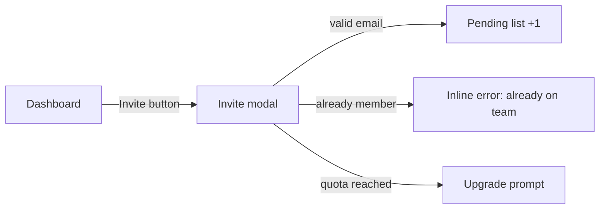

# Product Design

Code is the most expensive medium to discover a layout problem in. Between spec and implementation sits design: turn the spec's stories and states into screens, flows, and wireframes the user can veto in seconds. A wireframe exists to be cheap to throw away — fidelity is bought in rungs, never upfront.

## Routing

- Runs AFTER skill://product-spec (or a user-approved direction) and BEFORE implementation planning, whenever the deliverable has a UI surface.
- This skill owns WHAT the UI is: screens, layout, hierarchy, flows, states. skill://frontend-design owns HOW it is built: tokens, aesthetic direction, styling craft at implementation time. When both seem to apply and no wireframe exists yet, this skill goes first.
- SKIP when: no UI surface (API/CLI/worker), the change is a copy tweak (skill://frontend-ui-copy) or restyle inside an existing layout, or the user brings finished designs — then implementation reads those directly.

## Fidelity ladder — climb only as far as the decision requires

1. FLOW MAP + SCREEN INVENTORY (always) — mermaid flow + screen list in markdown. Decides navigation and scope.
2. ASCII WIREFRAMES (default) — box layouts per screen in fenced blocks. Diffable, terminal-renderable, commitable next to the spec. Decides layout, hierarchy, and state coverage.
3. HTML MOCKUP (on request, or when interaction/responsive behavior is the open question) — one static self-contained file per flow, real copy, fake data, no build step. Open it in the browser and walk it (per the repo's browser tooling; annotate/screenshot for feedback). Decides look-adjacent questions before real code.
4. GENERATED IMAGE MOCKUP (only when aesthetic direction itself is the question) — image-generation tooling for visual direction boards; NEVER a substitute for state-complete wireframes.

Rung 1+2 are the deliverable for most features. NEVER start at rung 3-4 while layout and states are undecided — high fidelity anchors taste debates before structure is settled.

## Step 1 — screen inventory & information architecture

From the spec's journey walk (skill://product-spec Step 3):

- List every SURFACE the feature touches: new screens, modified screens, modals/sheets, empty shells, settings entries, notification/email surfaces.
- For each: purpose (one line), entry points (how the user arrives), exit points (where they go next), and the spec stories it serves.
- Navigation model: where it hangs in the existing IA (nav item? contextual action? deep link only?). Name the existing screen patterns being reused — mirror the app's newest similar surface, NEVER invent a third navigation pattern beside two existing ones.

## Step 2 — flow map

One mermaid diagram per core flow: happy path PLUS the key failure/permission branches from the spec (a flow map with only the happy path is a brochure, not a design):



Rule: every edge is labeled with the ACTION that causes it; every spec failure class that changes what the user SEES appears as a branch.

## Step 3 — wireframe per screen, per state

ASCII box wireframe for each screen in the inventory. The state enumeration from the spec IS the checklist: default/success, empty (first-run), loading, each error class, partial. A state that renders differently gets its own frame; states that only swap copy get one frame + a copy table.

```
+----------------------------------------------------+
| Team members (3/5)                    [ Invite + ]  |
+----------------------------------------------------+
| [av] Ana Ruiz        Owner            (no action)   |
| [av] Ben Ito         Member           [ Remove ]    |
| [av] you@co.com      Pending...       [ Resend ]    |
+----------------------------------------------------+
| Quota: 3 of 5 seats used  ------------------ [====] |
+----------------------------------------------------+

EMPTY state: table -> illustration + "No members yet" + primary [ Invite + ]
QUOTA state: [ Invite + ] disabled + tooltip "Plan limit reached — Upgrade"
```

Annotate each wireframe with:

- HIERARCHY — the ONE primary action per screen; everything else is visibly secondary. Two primary actions = an undecided design, decide it here.
- COMPONENT REUSE — name the existing components/patterns each region maps to (mine the repo first; new component = a named, justified exception).
- COPY DIRECTION — real labels and error text per skill://frontend-ui-copy conventions, never lorem ipsum ("Save changes", not "CTA here").
- RESPONSIVE NOTE — what collapses/stacks/hides at narrow width; which interactions need touch targets.
- ACCESS NOTE — keyboard path and focus order for each interactive flow; what screen readers announce on state change (per skill://frontend-accessibility).
- DATA NOTE — where each dynamic value comes from (field/endpoint), so implementation inherits zero guesses.

## Step 4 — review gate

Present rung 1+2 to the user and STOP for approval before climbing rungs or handing off — vetoing a wireframe costs seconds; vetoing a built screen costs a sprint. Batch open design questions (max 4, each with your recommended default). Only after approval: escalate fidelity if asked, then hand off.

## Expected output — design doc

Save to `docs/product/design/YYYY-MM-DD-<topic>-ui.md`, sibling of the spec (user preference for location overrides):

```markdown
# <Topic> — UI Design (<YYYY-MM-DD>)

**Spec**: docs/product/specs/<date>-<topic>.md
## Screen inventory & IA    <- Step 1 (table: surface, purpose, entry, exit, stories)
## Flows                    <- Step 2 (mermaid per core flow, failure branches included)
## Wireframes               <- Step 3 (per screen x state, annotated)
## Copy table               <- labels/errors per state (frontend-ui-copy rules)
## Open design questions    <- owner + recommended default each
## Handoff notes            <- component reuse map, new-component exceptions, responsive rules
```

Mockup files (rung 3) live beside it: `docs/product/design/mockups/<topic>/<flow>.html`.

## Canvas companion (optional, spatial only)

When the screen inventory, multi-step flow, or journey benefits from pan/zoom review, ALSO emit a review-only canvas:

- Path: `docs/product/canvases/<topic>-journey.canvas.json` or `<topic>-ui.canvas.json`.
- Prefer `artifactType: "journey-map"` for phase × swimlane flows; use HTML mockups (skill://preview-templates / `$agent:presenter`) only for custom interactive UI, never as a substitute story/journey map.
- Wireframes and design Markdown stay authoritative; canvas is a companion, not a second source of layout truth.
- SKIP when the design is a single screen with no spatial relationships worth mapping.

Schema/limits/recipes: skill://preview-templates. Safe `refs` back to this design doc and the parent spec.

## Self-check rubric — before presenting

- Every inventory screen has a wireframe; every spec state appears in its owning screen's frames or the copy table — diff the spec's state list against the design doc and close every gap.
- Every flow diagram contains at least one non-happy branch.
- One primary action per screen; no unlabeled edges; no lorem ipsum anywhere.
- Every region maps to a named existing component, or carries a justified new-component exception.
- Entry AND exit points defined for every screen — no dead ends, no orphan screens.
- Responsive behavior noted for any layout that cannot shrink as-is.
- Keyboard path/focus order and screen-reader announcements covered for every interactive flow (ACCESS NOTE present per screen).

## Handoff

User approves → skill://product-architecture next when the work introduces a new service, store, queue, external integration, or NFR jump; otherwise implementation planning directly. The design doc + spec travel together to skill://frontend-design (tokens/aesthetic at build time), designer/frontend implementer agents, and skill://feature-anatomy wiring. Rendered result gets browser verification against the wireframes' state checklist.

## Fresher traps

Happy-path-only wireframes; jumping to HTML/image mockups while layout is undecided; lorem ipsum instead of copy direction; two primary actions per screen; inventing navigation pattern #3; wireframing states the spec never defined (scope creep in boxes); designing in your head and "confirming" with code; skipping the user veto gate because the wireframe "is obviously right".
